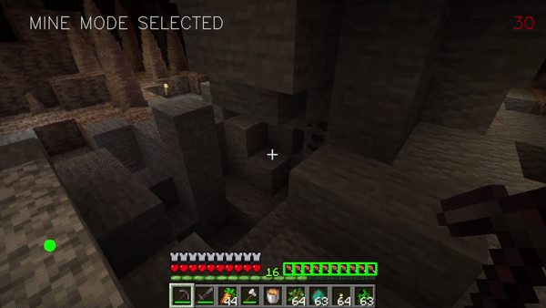
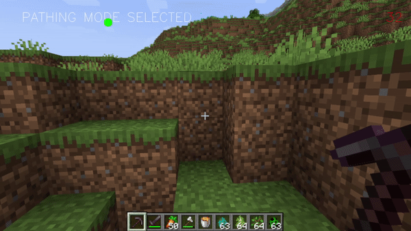

# MinecraftOpenCV-AutoController
An auto-controller for Minecraft utilizing OpenCV & OpenCV's Deep Nerual Network Module. Features modes like, avoidance, running, harvesting, mining, and guarding. Detections utilized by trained YoloV5s models converted to ONNX.

# Features
The program provides some neat features such as...   

## Modes
**Safe Walk**  

**Fighting** 

**Harvesting**

**Mining** 

**Sentry**

## Self Sustainability
**Auto Feeder**
   

**Auto Unstuck**
   

## Machine Learning
**Four Detectable Enemies**
- Creepr
- Zombie
- Spider
- Skeleton

**Two Detectable Trees**
- Oak
- Birch

**Seven Detectable Ores**
- Coal
- Diamond
- Redstone
- Gold
- Iron
- Lapis
- Redstone

## Limitations
- Poor detection at close and at longer ranges
- Easily looses track of enemies & other detections
- Cannot fight players
- Cannot fight most enemies
- Cannot harvest most trees
- Realistically can fight 1-2 enemies safely

## Tools
- Visaul Studio 2019
- Cuda 11.2
- Cudnn 8.8
- OpenCV 4.5.5

## System Specs
- i7 10700k
- RTX 3070
- 32 GB DDR4 Ram @ 3200MHz
- M.2 SSD

